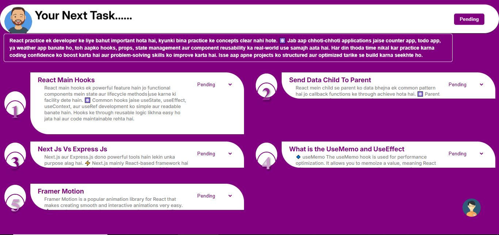
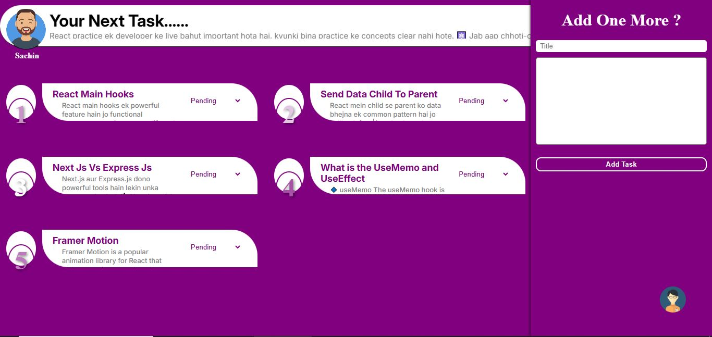
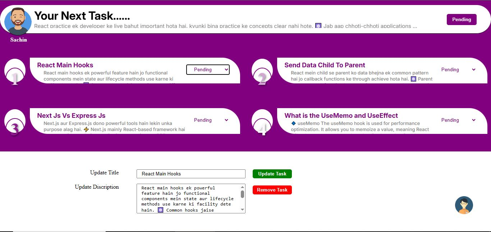
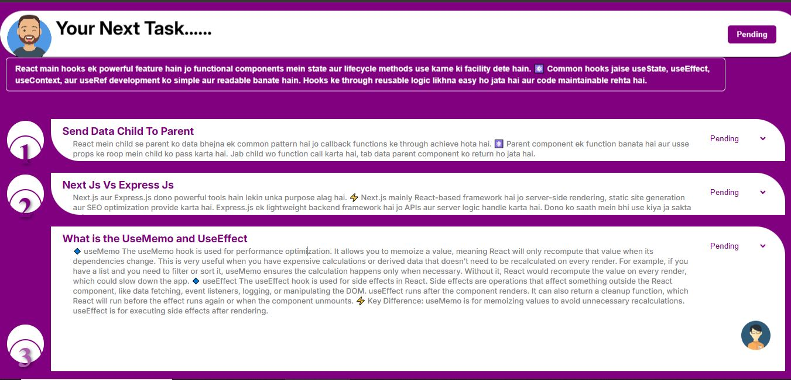
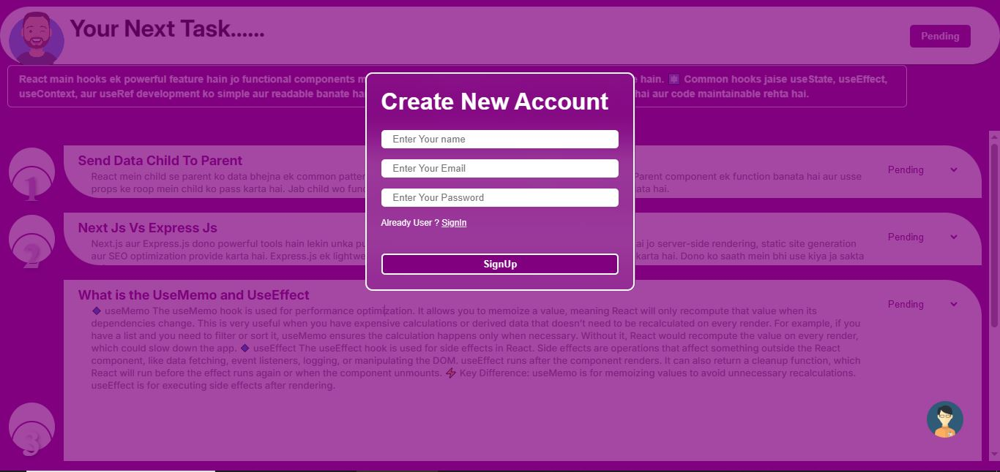

📝 Animated Todo App

A fully functional Todo Application built with React and Framer Motion, featuring smooth animations and complete authentication system. This app provides a modern and engaging user experience with features like login, signup, add, delete, update, and expand todos.

🚀 Features

✅ Authentication – Secure Login & Signup system
✅ Add Todo – Add new todos with a smooth slide-in form from the right
✅ Update Todo – Update existing todos with an animated bottom slide-in form
✅ Delete Todo – Remove todos instantly with animation
✅ Expandable Todos – Click on any todo to expand and view full details with smooth animation
✅ Todo Order – Latest added todo always appears at the top
✅ Modern UI – Built with Framer Motion animations for an elegant feel

🛠️ Tech Stack

⚛️ React – UI framework

🎬 Framer Motion – Animations

🎨 CSS Modules – Styling 

🔐 Authentication – Login & Signup system (JWT)

🗄️ Backend & Database – (Express + MongoDB)

📸 App Flow

User logs in or signs up

Dashboard displays todos with the latest at the top

Add a new todo → Form slides in from the right

Update an existing todo → Form slides in from the bottom

Expand any todo → View full details with animation

Delete todo → Smoothly removed from the list

📸 Screenshots

📦 Installation
# Clone the repo
git clone https://github.com/Sachin-Shah-25/Todo-Application.git

# Move into folder
cd animated-todo-app

# Install dependencies
npm install

# Run development server
npm start

# ✨ Future Enhancements
- Dark Mode 🌙  
- Add Time For Todo  
- Drag-and-drop reordering 🔄  
- Profile & user settings 👤  
- Todo categories & filters 🏷️  

